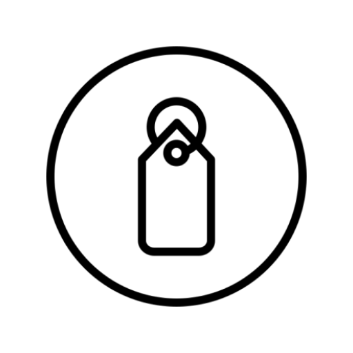

<!-- PROJECT LOGO -->
 

  

<h3 align="center">White Label</h3>
  

    Basic structure and features for new Android apps.
     
    <a href="https://appdistribution.firebase.dev/i/ac57e55786da5ad1">View Demo</a>
    ·
    <a href="https://github.com/pereyrarg11/White-Label/issues/new">Report Bug</a>
    ·
    <a href="https://github.com/pereyrarg11/White-Label/issues/new">Request Feature</a>
  

<!-- ABOUT THE PROJECT -->

## About The Project

The main goal of this project is to provide an empty app with basic functionalities, saving time for developers.
All industry-level apps have common functionalities and features like loggers, splash screen, dependencies, utility classes, CI/CD, etc.

Stop wasting time on trivial tasks!

By creating a repository from this template, you can save time and focus efforts in your project features.

### Built With

- [Gradle v1.8](https://developer.android.com/build/releases/gradle-plugin#8-1-0)
- [Java 17](https://formulae.brew.sh/formula/openjdk@17)
- [Kotlin v1.8.10](https://kotlinlang.org/)
- [Android 14 (API level 34)](https://developer.android.com/tools/releases/platforms#14)

### Core dependencies

- [Jetpack Compose](https://developer.android.com/jetpack/compose) a modern toolkit for building
  native UI
- [Dagger Hilt](https://dagger.dev/hilt/) for dependency injection
- [Material Design 3](https://m3.material.io/develop/android/jetpack-compose) to met best practices
  of user interface design
- [git-crypt](https://github.com/AGWA/git-crypt) to enable transparent encryption and decryption
  of files
- [Firebase App Distribution](https://firebase.google.com/docs/app-distribution/android/distribute-gradle)
  to distribute app versions painless
- [Firebase Analytics](https://firebase.google.com/docs/analytics/get-started?platform=android) as an app measurement solution.

<!-- GETTING STARTED -->

## Getting Started

You can clone this repository by following the nex steps:

1. Go to the top of this page.
2. Click **Use this template** (green button on right side).
3. Select Create a new repository.
4. Use the Owner dropdown menu to select the account you want to own the repository.
5. Type a name for your repository, and an optional description.
6. Choose a repository visibility.
7. Click Create repository from template.

For more information read the [Creating a repository from a template](https://docs.github.com/en/repositories/creating-and-managing-repositories/creating-a-repository-from-a-template) guide.

<!-- ROADMAP -->

## Roadmap

Some awesome features are missing right now. Follow this repo to get notified when they are ready!

- [x] Remote config
- [ ] In-app update

See the [open issues](https://github.com/pereyrarg11/White-Label/issues) for a full list of proposed
features (and known issues).

<!-- CONTRIBUTING -->

## Contributing

Contributions are what make the open source community such an amazing place to learn, inspire,
and create. Any contributions you make are **greatly appreciated**.

If you have a suggestion that would make this better, please fork the repo and create a pull request.
You can also simply open a [Feature request](https://github.com/pereyrarg11/White-Label/issues/new).
Don't forget to give the project a star! Thanks again!

1. Fork the Project
2. Create your Feature Branch (`git checkout -b feature/amazing-feature`)
3. Commit your Changes (`git commit -m 'Add some Amazing Feature'`)
4. Push to the Branch (`git push origin feature/amazing-feature`)
5. Open a Pull Request

<!-- CONTACT -->

## Contact

Gabriel Pereyra Roman

- [LinkedIn](https://www.linkedin.com/in/pereyrarg11/)
- [pereyrarg11.com](https://pereyrarg11.com/)
- [gabriel@pereyrarg11.com](mailto:gabriel@pereyrarg11.com)

Project Link: [https://github.com/pereyrarg11/White-Label](https://github.com/pereyrarg11/White-Label)

<!-- ACKNOWLEDGMENTS -->

## Acknowledgments

Resources I find helpful and would like to give credit to.

- [Detekt](https://detekt.dev/)
- [Sandwich](https://github.com/skydoves/sandwich)
- [git-crypt](https://github.com/AGWA/git-crypt)
- [JSONView](https://chromewebstore.google.com/detail/jsonview/gmegofmjomhknnokphhckolhcffdaihd)
- [JSON Editor Online](https://jsoneditoronline.org/)
- [Tinypng](https://tinypng.com/)
- [Android API Levels](https://apilevels.com)
- [Best-README-Template](https://github.com/othneildrew/Best-README-Template)
- [Color Hunt](https://colorhunt.co)
